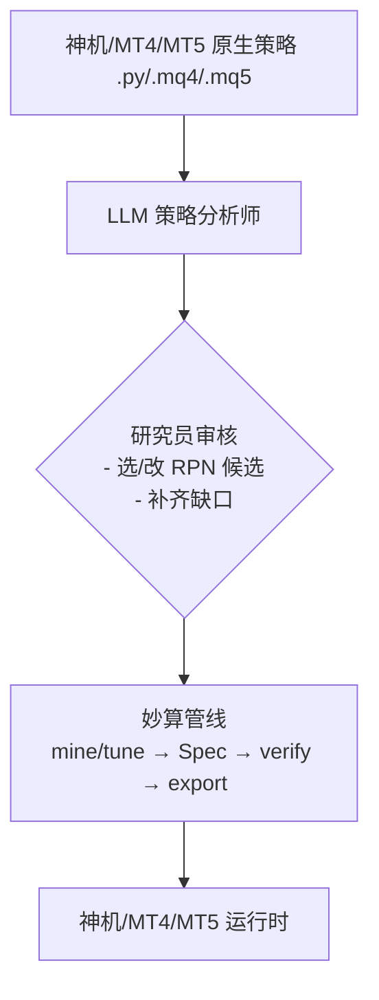

# LLM 辅助神机/MT4/MT5 策略 → 妙算 RPN 建模

## 目的
将量化研究员从“阅读复杂策略代码、手动查词表、尝试写 RPN 候选”这类机械劳动中解放出来，让 LLM 承担 80% 的前置工作，研究员专注于建模决策和回测验证。

## 前提假设
- 目标策略为 **神机/MT4/MT5 原生策略**（即非妙算导出的 .py 文件）
- 这些策略多为**命令式 if/else、状态机、依赖平台指标（TA-Lib/DataFactory）**
- 妙算只能接受**声明式 RPN 因子表达式**（`factor_t = f(OHLCV_{≤t})`，无记忆、无副作用）
- 因此策略的**出场逻辑、状态变量、外部依赖**（如自定义 DLL、网络请求）**无法直接映射**，需要人工拆解或舍弃

## 工作流概览


## LLM 能做的（副驾驶）

### 1. 策略结构化摘要
**输入**：完整策略源码 + 妙算词表导出（见下文）
**输出**：JSON，包含
```json
{
  "entry_logic": [
    {"type": "condition", "expression": "close <= bb_lower AND mfi <= 30", "weight": 1},
    {"type": "condition", "expression": "close >= bb_upper AND mfi >= 70", "weight": 1}
  ],
  "exit_logic": {
    "long": [
      {"type": "condition", "expression": "bb_reverse", "action": "exit_long"},
      {"type": "condition", "expression": "mfi_cross_above_50", "action": "exit_long"},
      {"type": "condition", "expression": "profit_drawdown > 0.3", "action": "exit_long"}
    ],
    "short": [...]
  },
  "parameters": {
    "mfi_period": 14,
    "mfi_oversold": 30,
    "mfi_overbought": 70,
    "bb_std": 2.0,
    "bb_period": 20,
    "atr_period": 20,
    "p_hard_atr": 2.0,
    "profit_drawdown_pct": 0.5,
    "exit_cooldown_seconds": 900
  },
  "indicators": ["bb", "mfi", "atr", "adx"],
  "notes": "策略有复杂出场分支（BB reverse/same-dir），需拆解为多因子+组合规则"
}
```

### 2. 指标 → 妙算 token 映射
**输出**：映射表 + 缺口清单
```json
{
  "mapping": {
    "bb_lower": "BB_LOWER",
    "bb_upper": "BB_UPPER",
    "mfi": "MFI14",
    "atr": "ATR",
    "adx": null   // 缺口：ADX 不在词表内
  },
  "missing_indicators": ["adx"],
  "suggestions": [
    "ADX 可用 DMI_ADX_14 替代（token 60）",
    "或考虑用其他趋势强度因子如 TREND_STRENGTH_50"
  ]
}
```

### 3. 生成候选 RPN 表达式
**输出**：3-5 组候选 + 自然语言解释
```json
{
  "candidates": [
    {
      "tokens": [62, 14, 203, 34, 61, 56, 18, 15, 16, 53, 55],
      "explanation": "RET20 BB_LOWER GT MFI14 LT ...  // 代表：收盘价 > BB 下轨 且 MFI < 30"
    },
    {
      "tokens": [10, 14, 203, 34, 61, 56, 18, 15, 16, 53, 55],
      "explanation": "RET  BB_LOWER GT MFI14 LT ...  // 同上，用 RET 替代 RET20"
    }
  ]
}
```

### 4. 参数化建议
**输出**：业务参数 → 语义旋钮 建议
```json
{
  "param_mapping": {
    "mfi_oversold": "NEUTRAL_BAND",    // 研究员判断：MFI 极端阈值对应中性带
    "bb_std": "ROLL_WINDOW",           // BB 带宽影响因子波动，对应滚动窗口
    "p_hard_atr": "SL_ATR_MULT",       // 硬止损倍数
    "profit_drawdown_pct": null        // 无直接对应，需出场因子拆解
  }
}
```

## LLM 做不了的（必须人工）

| 任务 | 原因 | 人工动作 |
|------|------|----------|
| **最终拍板 tokens** | 需对回测结果负责，LLM 无法跑回测 | 研究员选/改候选 → 在妙算里用 `fix tokens` 锁定 → 跑 `mine`/`tune` |
| **处理「出场逻辑→因子」拆解** | 神机出场通常是状态机，需拆成多因子+组合规则 | 研究员决定：是做多个因子？还是把出场逻辑放在组合层？ |
| **验证数值保真** | 只有回测才能证明因子等价 | 研究员用 `verify --data xxx` 对比原策略信号与妙算因子信号的一致性 |

## 文件位置

- 词表导出：`docs/llm_assisted_modeling/vocab_export.json`
- Prompt 模板库：`docs/llm_assisted_modeling/prompts/`（待建）
- LLM 调用脚本：待实现 `cli analyze` 命令

## 下一步

1. 建立 Prompt 模板库（4 类 Prompt）
2. 实现 `miaosuan analyze --file xxx.py` CLI 命令（调用本地/远程 LLM）
3. 建立对比验证脚本（算原策略信号 vs 妙算因子信号的一致性指标）

## 注意事项

- LLM 只能是“副驾驶”，决策权永远在量化研究员手中
- 所有 LLM 产出必须经回测验证才能入库
- 神机/MT4/MT5 原生策略中**无法映射的部分**（如外部依赖、状态变量、复杂出场）必须由人工判断：舍弃？拆解为多因子？还是保留在神机端运行？